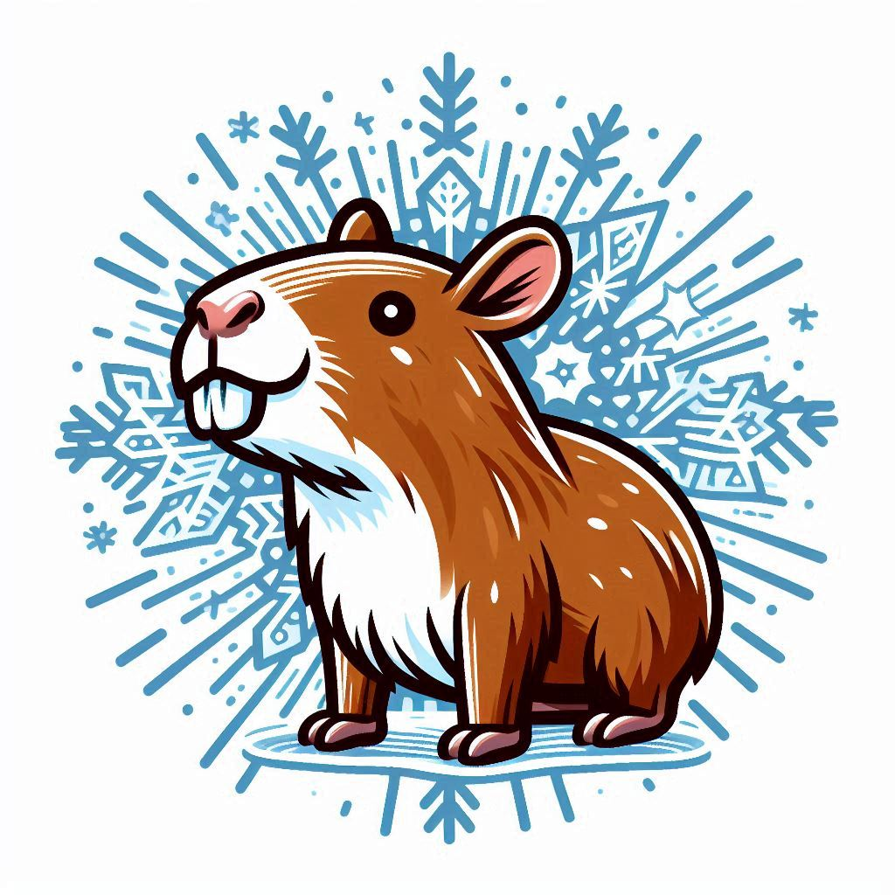

# CAPIBARA

## About

<p align="center">
  
</p>

Code for Athermal Phonon Interactions with BAllistic RAy-tracing

This library contains functions to simulate athermal phonons and the response of cryogenic detectors to these events.

Shield: [![CC BY 4.0][cc-by-shield]][cc-by]

## Citation

If you use this tool I would appreciate a citation, here is a handy suggested bibtex : 
```
@software{De_Santis_CAPIBARA_2025,
  author       = {De Santis, Alessio Ludovico},
  title        = {{CAPIBARA: Ray Phonon Simulations for Cryogenic Experiments}},
  year         = 2025,
  version      = {v1.1},
  publisher    = {Zenodo},
  doi          = {10.5281/zenodo.17494662},
  url          = {https://doi.org/10.5281/zenodo.17494662},
  keywords     = {Phonons, Cryogenics, Athermal phonon simulations}
}
```


[![CC BY 4.0][cc-by-image]][cc-by]

[cc-by]: http://creativecommons.org/licenses/by/4.0/
[cc-by-image]: https://i.creativecommons.org/l/by/4.0/88x31.png
[cc-by-shield]: https://img.shields.io/badge/License-CC%20BY%204.0-lightgrey.svg
